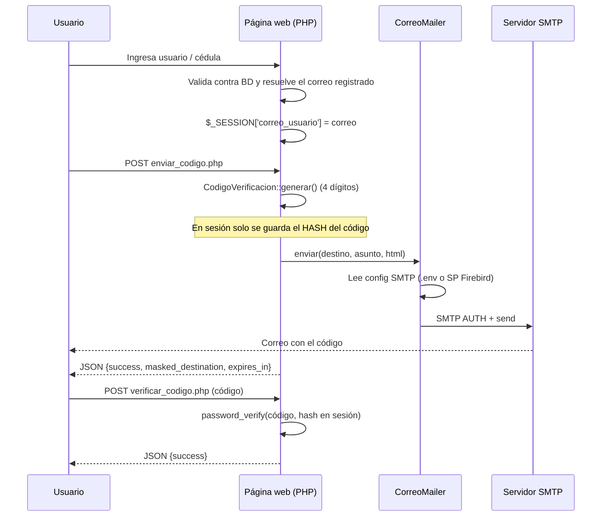

# Mensajería de correo para login (2FA y recuperación de contraseña)

Módulo portable y autocontenido para **enviar códigos de verificación por correo** desde el
login de una página web: verificación en dos pasos y recuperación de contraseña.

Extraído de la implementación real de `apValledupar` (rama `ALC-74-seguridad-en-2-pasos`),
consolidando en un solo servicio la lógica que allá está duplicada inline en tres archivos.

---

## 1. De dónde sale esto

En `apValledupar` el envío de correo **no** está en el módulo `Notification/`
(su `EmailChannel` es un stub que hace `return true;` sin enviar nada). El envío real
está escrito a mano, con PHPMailer, **duplicado en tres archivos**:

| Archivo original | Qué hace |
|---|---|
| `init/send_2fa.php` | Envía el código 2FA tras el login |
| `init/resend_2fa.php` | Reenvía el código 2FA |
| `init/recuperar_clave.php` | Flujo completo de recuperación de contraseña |

Los tres repiten el mismo bloque: abrir PDO a Firebird → leer credenciales SMTP del
procedimiento `CORREO_BUSCA_X_ID(1, 'BUSCAR')` → configurar PHPMailer → armar el HTML → enviar.

Este paquete unifica ese bloque en `CorreoMailer` y lo deja usable en cualquier proyecto PHP.

---

## 2. Cómo funciona el flujo



**Reglas del código de verificación**

- 4 dígitos, generados con `random_int()` (generador criptográficamente seguro).
- Vigencia de 5 minutos.
- En `$_SESSION` se guarda **solo el hash** (`password_hash`), nunca el código plano.
- Un solo uso: se invalida al validarse correctamente.
- Máximo 5 intentos fallidos; al superarlos el código se destruye.
- Ventana mínima de 60 segundos entre reenvíos.

---

## 3. Contenido del paquete

```
loginmanesajeriacorreo/
├─ README.md                     ← este archivo
├─ bootstrap.php                 ← autoloader + carga de .env. Único require necesario
├─ composer.json                 ← dependencias (PHPMailer ^6.10)
├─ .env.example                  ← plantilla de configuración
├─ src/
│  ├─ Config/
│  │  ├─ SmtpConfig.php               ← objeto de configuración SMTP
│  │  ├─ ConfigProviderInterface.php  ← contrato de las fuentes de config
│  │  ├─ EnvConfigProvider.php        ← lee la config de variables .env  (portable)
│  │  └─ FirebirdConfigProvider.php   ← lee la config del SP CORREO_BUSCA_X_ID
│  ├─ Mailer/
│  │  ├─ CorreoMailer.php             ← el servicio de envío
│  │  └─ CorreoException.php          ← excepción del módulo
│  ├─ Templates/
│  │  └─ PlantillaCodigo.php          ← HTML + texto plano + asuntos
│  └─ Verification/
│     └─ CodigoVerificacion.php       ← generar / validar / expirar el código
├─ examples/
│  ├─ enviar_codigo.php          ← endpoint AJAX: enviar
│  ├─ verificar_codigo.php       ← endpoint AJAX: validar
│  ├─ reenviar_codigo.php        ← endpoint AJAX: reenviar
│  ├─ demo.php                   ← página de prueba end-to-end
│  └─ probar_smtp.php            ← prueba de humo por consola
└─ sql/
   └─ 01_correo_config.sql       ← tabla + SP de configuración (RECONSTRUIDO, ver §7)
```

---

## 4. Instalación

**Requisitos:** PHP >= 7.4 con `ext-openssl` y `ext-mbstring`.

```bash
# 1. Copia la carpeta a tu proyecto
cp -r loginmanesajeriacorreo /ruta/de/tu/proyecto/

# 2. Instala PHPMailer (dentro de la carpeta o en el proyecto contenedor)
cd /ruta/de/tu/proyecto/loginmanesajeriacorreo
composer install

# 3. Configura las credenciales
cp .env.example .env
#    y edita SMTP_HOST / SMTP_USER / SMTP_PASS
```

`bootstrap.php` busca el `vendor/autoload.php` primero dentro de la carpeta del módulo y
luego tres niveles arriba, así que funciona tanto autónomo como embebido en un proyecto
que ya tenga PHPMailer instalado.

**Verifica antes de integrar:**

```bash
php examples/probar_smtp.php tucorreo@dominio.com
# con traza SMTP completa:
php examples/probar_smtp.php tucorreo@dominio.com --debug
```

Si ese comando entrega el correo, el resto es solo cablear tus endpoints.

---

## 5. Configuración

El módulo lee las credenciales SMTP a través de un *provider*. Hay dos:

### Opción A — Variables de entorno (recomendada al portar)

```php
use App\Correo\Config\EnvConfigProvider;

$mailer = new CorreoMailer(new EnvConfigProvider());
```

```ini
SMTP_HOST=smtp.tudominio.com
SMTP_PORT=465
SMTP_USER=notificaciones@tudominio.com
SMTP_PASS=clave_de_la_cuenta
SMTP_FROM_NAME=Notificaciones
SMTP_SECURE=ssl        # ssl → puerto 465 | tls → puerto 587
```

### Opción B — Base de datos Firebird (como apValledupar hoy)

```php
use App\Correo\Config\FirebirdConfigProvider;

// Lee BD_HOST_ENV / USER_ENV / PASS_ENV del entorno
$mailer = new CorreoMailer(FirebirdConfigProvider::desdeEnv(1));
```

Ejecuta `SELECT * FROM CORREO_BUSCA_X_ID(1, 'BUSCAR')` y mapea las columnas
`SERVER`, `PUERTO`, `USUARIO`, `USUARIOCLAVE`, `USUARIONOM`.
Requiere la extensión `pdo_firebird`.

> Cambiar de una opción a la otra es cambiar **una línea**. El `CorreoMailer` no
> sabe de dónde salen las credenciales.

---

## 6. Uso

### Envío directo

```php
require_once __DIR__ . '/loginmanesajeriacorreo/bootstrap.php';

use App\Correo\Config\EnvConfigProvider;
use App\Correo\Mailer\CorreoMailer;
use App\Correo\Mailer\CorreoException;
use App\Correo\Templates\PlantillaCodigo;

$mailer = new CorreoMailer(new EnvConfigProvider());

try {
    $mailer->enviar(
        'usuario@dominio.com',
        PlantillaCodigo::asunto(),
        PlantillaCodigo::html('4821'),
        PlantillaCodigo::texto('4821')
    );
} catch (CorreoException $e) {
    error_log($e->getMessage());   // detalle técnico → log
    // mensaje genérico → usuario
}
```

### Ciclo completo con código

```php
use App\Correo\Verification\CodigoVerificacion;

$verificacion = new CodigoVerificacion('2fa');   // o 'recuperacion'

// -- Paso 1: generar y enviar
$codigo = $verificacion->generar();              // devuelve el código PLANO
$mailer->enviar($correo, PlantillaCodigo::asunto(), PlantillaCodigo::html($codigo));

// -- Paso 2: validar lo que escribió el usuario
$r = $verificacion->validar($_POST['codigo']);

if ($r['ok']) {
    session_regenerate_id(true);
    $_SESSION['verificado'] = true;
} else {
    // $r['motivo']: SIN_CODIGO | EXPIRADO | MAX_INTENTOS | CODIGO_INVALIDO
}
```

El parámetro del constructor (`'2fa'`, `'recuperacion'`) separa los códigos en sesión,
así un proceso no pisa al otro.

### Referencia rápida

| Clase | Método | Devuelve |
|---|---|---|
| `CorreoMailer` | `enviar($destino, $asunto, $html, $texto = '')` | `bool` / lanza `CorreoException` |
| `CorreoMailer` | `setDepurar(bool)` | traza SMTP (solo depuración) |
| `CorreoMailer` | `CorreoMailer::enmascarar($email)` *(estático)* | `us*****@dominio.com` |
| `CodigoVerificacion` | `generar()` | `string` código plano |
| `CodigoVerificacion` | `validar($ingresado)` | `['ok' => bool, 'motivo' => string]` |
| `CodigoVerificacion` | `segundosRestantes()` | `int` |
| `CodigoVerificacion` | `hayCodigoVigente()` | `bool` |
| `CodigoVerificacion` | `limpiar()` | `void` |
| `PlantillaCodigo` | `html($codigo, $minutos = 5, $esReenvio = false)` | `string` HTML |
| `PlantillaCodigo` | `texto(...)` / `asunto($esReenvio, $contexto)` | `string` |

### Contrato de los endpoints de ejemplo

Los tres responden JSON y esperan `POST`:

| Endpoint | Entrada | Salida |
|---|---|---|
| `enviar_codigo.php` | — (destino en `$_SESSION['correo_usuario']`) | `{success, message, masked_destination, expires_in}` |
| `reenviar_codigo.php` | — | igual que el anterior |
| `verificar_codigo.php` | `codigo` | `{success, message}` |

---

## 7. Advertencias y decisiones tomadas

**El archivo `sql/01_correo_config.sql` es una reconstrucción, no el DDL real.**
No se pudo extraer de `APVALLEDUPAR_DESARROLLO` porque el cliente `isql` instalado
localmente es 2.5 y el servidor rechaza la autenticación. El contrato (nombres y orden
de columnas) se dedujo del código PHP que consume el procedimiento. Antes de usarlo en
un ambiente nuevo, extrae el objeto real:

```sql
SELECT RDB$PROCEDURE_SOURCE FROM RDB$PROCEDURES
 WHERE RDB$PROCEDURE_NAME = 'CORREO_BUSCA_X_ID';
```

**Diferencias respecto al código original de `apValledupar`.** Estas son mejoras
aplicadas al extraer; si vas a reemplazar el código original con este módulo, tenlas presentes:

| # | Original | Aquí |
|---|---|---|
| 1 | Bloque PHPMailer duplicado en 3 archivos | Un solo `CorreoMailer` |
| 2 | `$code2fa` interpolado crudo en el HTML | `htmlspecialchars()` antes de interpolar |
| 3 | Sin límite de intentos fallidos | Máximo 5, luego se destruye el código |
| 4 | El código seguía válido tras usarse | Un solo uso |
| 5 | Sin `AltBody` (texto plano) | Incluido, mejora entregabilidad |
| 6 | Reenvío sin ventana mínima | 60 s entre reenvíos |
| 7 | `recuperar_clave.php` guarda `recovery_code_plain` en sesión | Nunca se persiste el código plano |
| 8 | Sin `session_regenerate_id` tras verificar | Se regenera (evita fijación de sesión) |

**Seguridad al integrar:**

- El correo destino **nunca** debe venir del cliente. Resuélvelo en el servidor a partir
  del usuario autenticado. `examples/demo.php` sí lo pide por input **solo porque es una demo**.
- Muestra siempre el destino enmascarado (`CorreoMailer::enmascarar()`), no el correo completo.
- No devuelvas `CorreoException::getMessage()` al navegador: contiene host y cuenta SMTP.
  Va al log; al usuario, un mensaje genérico.
- Añade CSRF a los endpoints. Los ejemplos lo omiten para no arrastrar el `CsrfHandler`
  de `apValledupar`; si integras allá, reutiliza `App\Auth\Security\CsrfHandler`.
- No respondas distinto según si el correo existe o no: eso permite enumerar usuarios.
- Añade rate limiting por IP además del control por sesión que ya trae el módulo.
- La clave SMTP queda en texto plano (en `.env` o en la tabla `CORREO`). Restringe permisos
  de lectura sobre ambos.

**Puertos y cifrado:** `465` va con `SMTP_SECURE=ssl`; `587` va con `tls`. Combinarlos
al revés es la causa más común de fallo de conexión.

---

## 8. Aviso automático de cumpleaños

Revisa diariamente si algún trabajador cumple años y, de ser así, le envía
un correo de felicitación y avisa a gerencia.

### Componentes

| Archivo | Rol |
|---|---|
| `data/cumpleanos.csv` | Roster real: `nombre,correo,dia,mes`. **Nunca se versiona en git.** |
| `data/cumpleanos.csv.example` | Ejemplo con datos ficticios, sí versionado. |
| `data/.htaccess` | Bloquea el acceso HTTP directo a la carpeta `data/`. |
| `src/Cumpleanos/RepositorioCumpleanos.php` | Lee y valida el CSV. |
| `src/Cumpleanos/BuscadorCumpleanos.php` | Filtra quién cumple años hoy. |
| `src/Cumpleanos/RegistroEnviados.php` | Evita reenvíos si el cron corre dos veces el mismo día. |
| `src/Cumpleanos/RevisorCumpleanos.php` | Orquesta todo lo anterior. |
| `src/Templates/PlantillaCumpleanos.php` | Correos de felicitación y de aviso a gerencia. |
| `cron/revisar_cumpleanos.php` | Punto de entrada para el cron. |
| `examples/probar_cumpleanos.php` | Prueba manual con fecha simulada. |

### Configurar el roster

Copia `data/cumpleanos.csv.example` como `data/cumpleanos.csv` y reemplaza
los datos de ejemplo por los reales (uno por trabajador):

```csv
nombre,correo,dia,mes
Juan Perez,juan.perez@ejemplo.com,15,MARZO
```

El mes acepta número (`3`) o nombre en español (`MARZO`). **Este archivo
contiene datos personales: nunca lo subas a git, y en el servidor déjalo
con permisos `640` o más restrictivos** (`chmod 640 data/cumpleanos.csv`).

### Configurar el correo de gerencia

En `.env`:

```ini
GERENCIA_EMAIL=gerencia@tudominio.com
```

### Programar el cron en cPanel

En cPanel → Cron Jobs, agrega una tarea diaria (ej. a las 00:10):

```
10 0 * * * php /home/tu_usuario/public_html/ruta/a/API/MensajeriaCorreo/cron/revisar_cumpleanos.php >> /home/tu_usuario/logs/cumpleanos.log 2>&1
```

Ajusta la ruta absoluta según dónde quede desplegado el módulo en tu
hosting.

### Probar sin esperar a un cumpleaños real

```bash
php examples/probar_cumpleanos.php 15-03              # simula, no envia
php examples/probar_cumpleanos.php 15-03 --enviar     # envia de verdad
```

### Seguridad

- `data/cumpleanos.csv` y `data/cumpleanos_enviados.json` están en
  `.gitignore`: nunca deben llegar a un commit.
- `data/.htaccess` bloquea cualquier acceso HTTP directo a esos archivos.
- Los logs solo muestran el correo enmascarado (`CorreoMailer::enmascarar()`),
  nunca el correo completo.
- El aviso a gerencia solo incluye el nombre del cumpleañero, no el roster
  completo ni las fechas de nacimiento de los demás.
